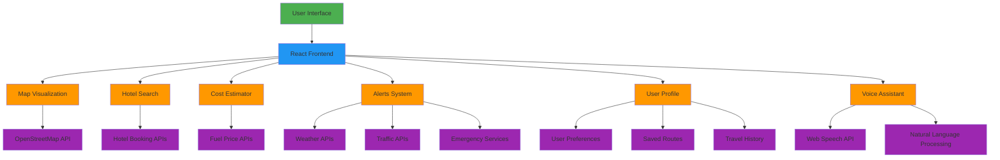

# TransRoute Architecture

## Component Overview

### 1. User Interface Layer
- **Dashboard**: Main landing page with feature overview
- **Map View**: Interactive map with route visualization
- **Hotel Search**: Interface for finding and booking accommodations
- **Cost Estimator**: Fuel and travel cost calculation tools
- **Alerts Panel**: Real-time notifications and warnings
- **User Profile**: Personalization and account management
- **Voice Assistant**: Speech-based interaction system

### 2. Data Sources
- **OpenStreetMap API**: Map data and routing information
- **Hotel Booking APIs**: Integration with booking platforms
- **Fuel Price APIs**: Current fuel pricing data
- **Weather APIs**: Meteorological information
- **Traffic APIs**: Real-time traffic conditions
- **Emergency Services**: Natural disaster and hazard alerts

### 3. Core Features
- **Route Planning**: Intelligent pathfinding with optimization
- **Personalization**: User preferences and history tracking
- **Real-time Updates**: Dynamic information refresh
- **Multi-modal Transport**: Support for various vehicle types
- **Accessibility**: Voice commands and mobile responsiveness