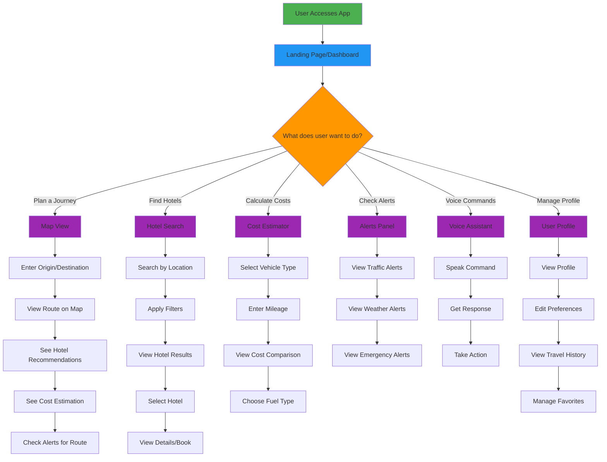

# TransRoute User Flow

## Detailed User Journeys

### 1. Planning a New Journey
1. User accesses the application
2. Lands on the dashboard with search options
3. Enters origin and destination in the search bar
4. Navigates to the Map View
5. Views the suggested route on the interactive map
6. Sees recommended hotels along the route
7. Gets cost estimation for the journey
8. Checks alerts for any issues on the route
9. Saves the route for future reference

### 2. Finding Accommodation
1. User accesses the application
2. Navigates to the Hotel Search feature
3. Enters a location (city or landmark)
4. Applies filters for budget, rating, and amenities
5. Views hotel results with images and details
6. Selects a hotel to view more details
7. Optionally books the hotel directly
8. Saves the hotel to favorites for future trips

### 3. Cost Estimation
1. User accesses the application
2. Navigates to the Cost Estimator
3. Selects their vehicle type
4. Enters their vehicle's mileage
5. Views cost comparison for different fuel types
6. Chooses the most economical option
7. Saves preferences for future calculations

### 4. Staying Informed
1. User accesses the application
2. Views the Alerts Panel
3. Sees traffic conditions on their planned route
4. Checks weather forecasts for travel days
5. Receives emergency alerts if any
6. Enables push notifications for real-time updates

### 5. Voice Interaction
1. User accesses the application
2. Opens the Voice Assistant
3. Speaks their command ("Plan a route from Delhi to Mumbai")
4. Receives a spoken response with options
5. Confirms or modifies the suggestions
6. Takes action based on voice guidance

### 6. Profile Management
1. User accesses the application
2. Navigates to their Profile
3. Updates personal information
4. Sets travel preferences
5. Views their travel history
6. Manages favorite routes and hotels
7. Adjusts notification settings

## User Personas

### 1. The Business Traveler
- Primary needs: Fast route planning, quality hotels, cost tracking
- Frequency: Weekly or monthly travel
- Devices: Laptop and smartphone
- Key features: Quick search, expense tracking, reliable hotels

### 2. The Family Vacationer
- Primary needs: Family-friendly accommodations, scenic routes, weather information
- Frequency: Few times per year
- Devices: Smartphone and tablet
- Key features: Hotel amenities filter, route visualization, alerts

### 3. The Road Trip Enthusiast
- Primary needs: Detailed route information, fuel cost optimization, points of interest
- Frequency: Monthly or seasonal trips
- Devices: Smartphone and in-car devices
- Key features: Detailed maps, fuel calculator, voice assistant

### 4. The Budget-Conscious Traveler
- Primary needs: Cost-effective options, budget accommodation, fuel savings
- Frequency: As needed
- Devices: Smartphone
- Key features: Cost estimator, budget filters, deal alerts

## Accessibility Considerations

### Visual Impairments
- Voice assistant as primary navigation method
- High contrast mode for better visibility
- Screen reader compatibility

### Motor Impairments
- Keyboard navigation support
- Voice command alternatives
- Large touch targets

### Cognitive Impairments
- Simple, consistent interface
- Clear instructions and feedback
- Error prevention and recovery

## Internationalization

### Language Support
- Hindi interface option
- Regional dialect support
- Translation services for user-generated content

### Cultural Adaptation
- Local customs and preferences
- Regional hotel chains and services
- Localized alert systems

This user flow diagram and documentation provides a comprehensive overview of how users interact with the TransRoute application and identifies key areas for enhancement and optimization.